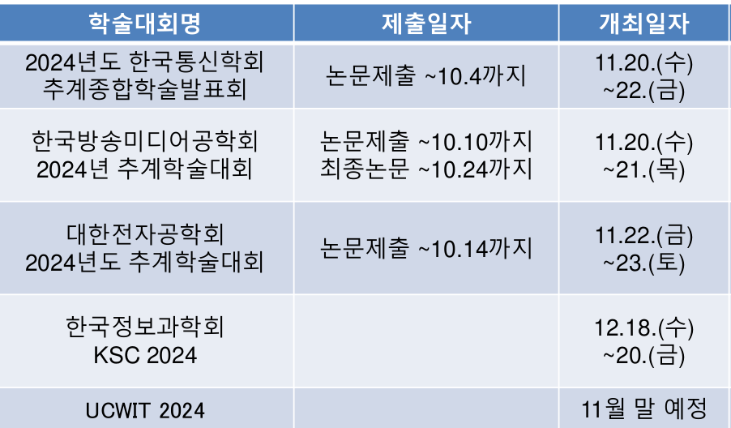

# 프로젝트 주차별 계획 (수정 중...)

- 1주차
    - 프로젝트 브리핑핑 (멘토님과의 회의)
    - 팀원간 역할 분담
- 2주차
    - AI 기본 개념 학습
        - AIHub 데이터 셋 탐색(데이터의 분류, 어떤 음식이 들어있는지지)
        - AIHub에서 제공하는 데이터 셋 이해(데이터가 어떤 형태로 저장되어있는지지)
        - YOLOv10에 대한 탐색색
    - git & github 스터디
        - 기초 사용법 숙지
        - commit / Branch 협업 정책 수립
- 3~4주차
    - AI 담당
        - 객체인식에 대한 이론적 접근
        - 이론을 바탕으로한 간단한 실습
        - 객체인식 모델 개발
    - Front/Back
        - 기존 서비스 앱의 코드 파악
        - UX/UI의 요구 분석 검증
        - 구조적 모델링, 동적 모델링 작성
        - 모델 검증
- 5~6주차
    - AI 담당
        - 모델 개발 및 훈련
    - Front/Back
        - AI 모델 결과를 앱에 표시하는 UI 구현
        - AI 모델과 기존 서비스 연동 방법에 대한 스터디
- 7~8주차
    - AI 담당
        - 멀티플 타겟 모델(객체인식과 동시에 음식 분류)
        - 모델 개발 및 훈련
    - Front/Back 담당
        - 시간별 데이터 연동 기능 구현
        - AI 모델과 기존 서비스 연동
        - 기능 테스트 및 버그 수정
- 9주차
    - 정확한 비교를 통한 모델 선택 후 모델의 개선 방법 탐구

- 아직 정리되지 않은 계획
        - 논문 작성을 위한 연구 조사
            - (논문의 경우 아래 사진처럼 6~7주차에는 제출해야하는 것으로 보여 초반에 뼈대를 작성하고 프로젝트 개발과 동시에 채워넣어야 할거 같습니다.)
                
                

