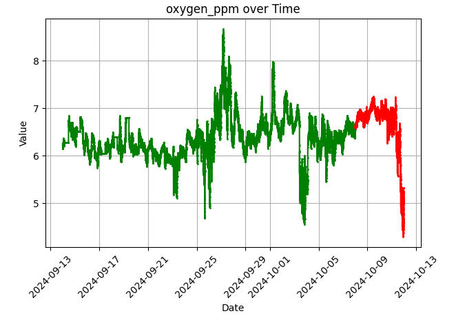
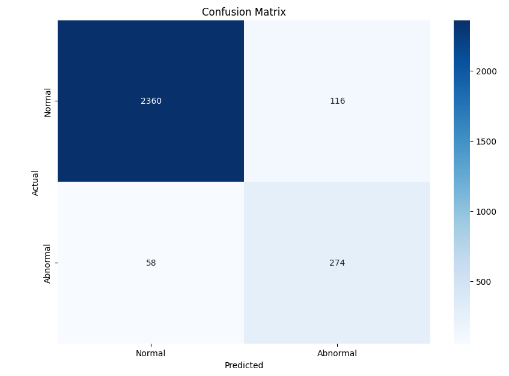
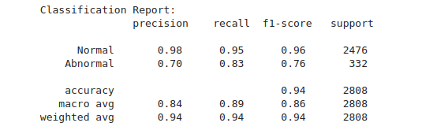
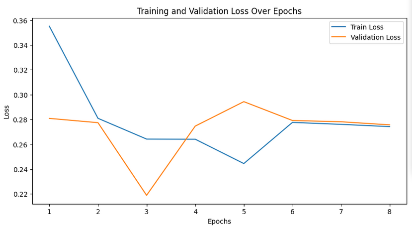
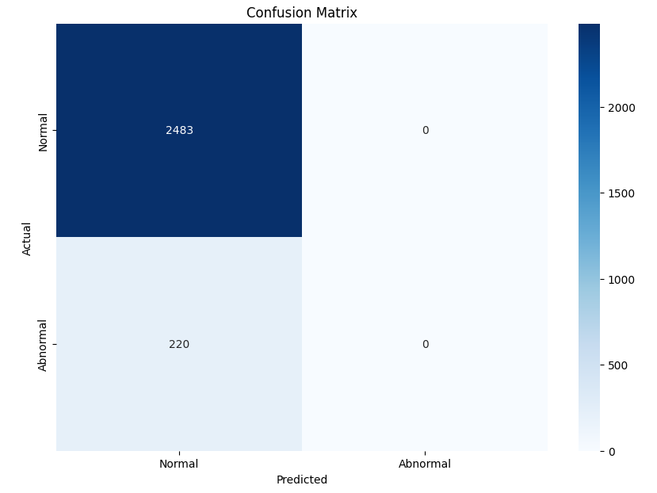

# 박영찬

“비정상 데이터를 어떻게 정의할까”를 중점으로 여러가지를 해본 기록

- 추출한 데이터
    - wando2 : 6월 7일 ~ 10월 11일
    - wando1 : 6월 7일 ~ 9월 14일
    - wando1b : 10월 14일 ~ 10월 29일

기존의 바이오파울링 **탐지** AI는 현재 데이터가 바이오파울링인지 아닌지를 파악하는것이 목표였다면 수정된 바이오파울링 예측 AI는 현재 데이터를 분석하여 앞으로 바이오파울링이 일어날지 예측하는 것이 목표이다.

> **진행하기전 수정된 목표를 달성하기 위한 주의사항**
> 
> 
> 1. time step 기준 하루(720개)로 변경
> 
> 2. 용존산소 3 이하는 무조건 바이오파울링
> 
> 3. abnormal 데이터를, 정상 패턴이 나타나다가 0으로 떨어지기 전으로 재정의 필요
> 
> 4. normal 데이터는 정상 패턴 데이터 기간만 활용
> 
> 5. (!!주의사항!!) 다른 시퀀스 그룹(디바이스 기준)은 슬라이딩 처리 시 따로 변수 만들어서 돌려서 np concat 해야됨
> 
> ex) wando 01, 02에서 용존 산소가 떨어지는 구간이 따로 나타나는데, 해당 두 그룹의 데이터는 시계열이 이어지지 않기 때문에 한번에 이어서 해버리면 안됨
> 
> 6. (!!주의사항2!!) time step을 720개로 하기 때문에, 비정상 패턴이 나타나기 719개 전까지 데이터를 abnormal로 할당해야 함
> 

바이오파울링이 일어나기 직전 데이터를 비정상 데이터로 정하는 것이기때문에 한번의 학습데이터에 하나의 디바이스에서 얻은 데이터만 넣는 것이 타당해 보였다.(주의사항 5번)

## 첫번째 시도 - wando2

- 데이터 - wando2
    
    
    
    - 정상 데이터 : 9월 14일 ~ 10월 7일
    - 비정상 데이터 : 10월 8일 ~ 10월 12일
        - 10월 12일에 용존산소 3이하로 바이오파울링이 확실. 따라서 10월 12일 중 용존산소 4 이하로 떨어지기 전 데이터를 비정상데이터로 할당
        - 다만 하루만 비정상 데이터로 할당하면 비정상 시퀀스의 개수가 부족하여 제대로 학습이 되지 않을 것 같아 기간을 4일전까지로 할당
- 결과
    
    
    
    
    

첫번째 시도에서 비정상데이터를 용존산소 4이하가 되기 전으로 할당하였는데 그 전의 정상 패턴에서는 거의 6이상 이었기에 결국 용존산소에만 의지하는 분석 결과를 얻은것이고 패턴을 분석한 결과는 아닌 것 같아서 두번째 시도를 시작하였다.

## 두번째 시도 - wando2

- 데이터 - wando2
    
    
    
    - 정상 데이터 : 9월 14일 ~ 10월 7일
    - 비정상 데이터 : 10월 8일 ~ 10월 10일
        - 10월 12일에 용존산소 3이하로 바이오파울링이 확실. 따라서 10월 11일에는 눈에 띄는 하락이 감지되어 그 이전 데이터인 10월 10일까지를 비정상 데이터로 할당
- 결과
    - epoch가 8번만에 stop되었다.
    
    
    
    
    
    - AI가 모든 데이터를 정상으로 판단하는 치우친 결과가 나왔다.
    - AI도 정상 데이터와 비정상 데이터의 차이를 분석하지 못한거라고 이해중이다.

좀 더 다른 데이터가 필요할 것 같아 추가적인 데이터를 추출하였다.

## 세번째 시도 - 데이터 추출

- 바이오파울링이 일어난 또 다른 데이터를 찾고자 추출
    - wando1
        - 정상데이터
            
            [wando01(7-2~7-26).xlsx](wando01(7-27-26).xlsx)
            
            [wando01(6-7~7-1).xlsx](wando01(6-77-1).xlsx)
            
        - 의심 데이터
            
            [wando01(7-27~8-20).xlsx](wando01(7-278-20).xlsx)
            
            [wando01(8-21~9-14).xlsx](wando01(8-219-14).xlsx)
            
    - wando2
        - 정상 데이터
            
            [wando2(7-27~8-20).xlsx](wando2(7-278-20).xlsx)
            
            [wando2(8-21~9-14).xlsx](wando2(8-219-14).xlsx)
            
            [wando2(9-14~10-7).xlsx](wando2(9-1410-7).xlsx)
            
        - 의심 데이터
            
            [wando02(6-18~7-1).xlsx](wando02(6-187-1).xlsx)
            
            [wando02(7-2~7-26).xlsx](wando02(7-27-26).xlsx)
            
            [wando2(10-8~10-11).xlsx](wando2(10-810-11).xlsx)
            
    - wando1b
        - 10월 14일 이전 데이터는 없음
            
            [wando01b(10-14~10-30).xlsx](wando01b(10-1410-30).xlsx)
            
- 문제
    - 이전의 데이터는 용존 산소 3이상으로 뚝 떨어져서 바이오파울링의 기준이 비교적 명확해서 비정상 데이터를 어느구간으로 할당할지 파악이 가능했다
    - 그러나 위의 의심 데이터는 애매모호하게 하락하면서 바이오파울링인지 아닌지 파악하기 힘든 데이터도 있으며 오히려 용존산소가 급격하게 올라가는 데이터도 있어 비정상 데이터를 혼자 결정하기에 무리가 있어보여 분석을 보류하였다.

## 알고리즘 탐색

- GRU와 RNN을 담당하였지만 학습데이터의 문제가 우선 해결되지 않으면 알고리즘을 비교하는 것이 의미가 없기 때문에 기초적인 지식만 학습하였다.
- 추가적으로 기존의 GRU 모델 코드 대신 chatGPT가 짜준 RNN모델을 넣어 코드를 실행시켰을 때 문제 없이 잘 돌아가는 것도 확인하였다.