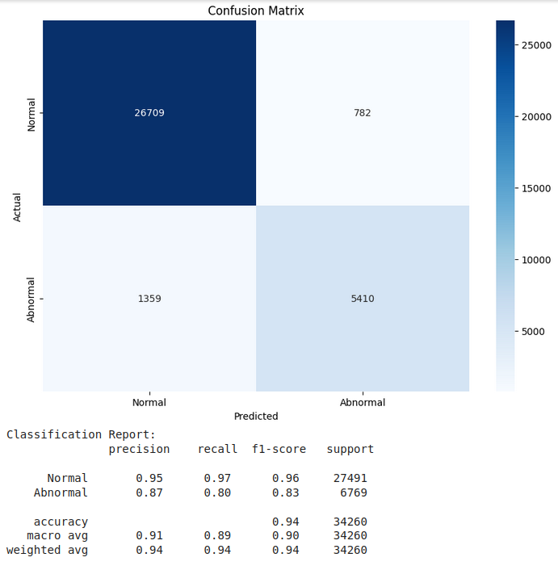
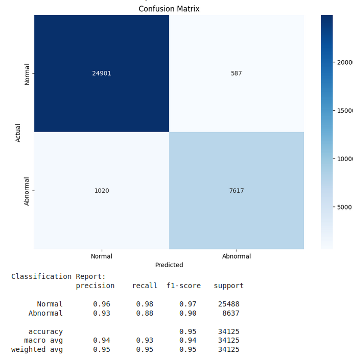
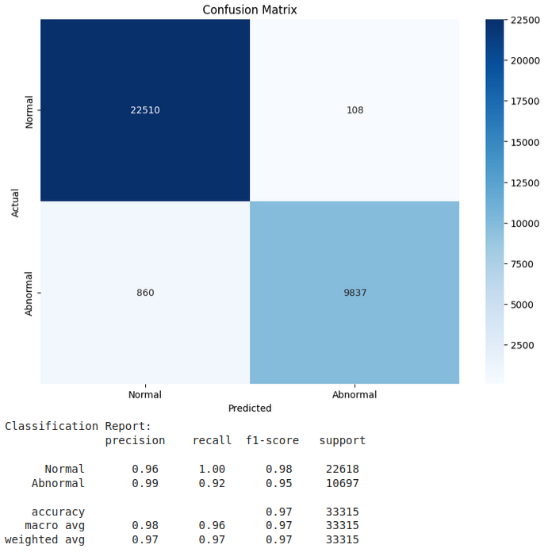
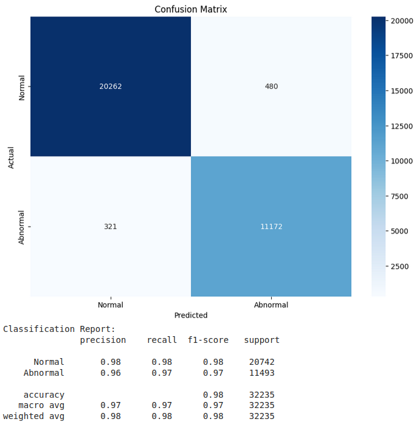

# 학습 구간

```python
# 학습 데이터 정의
# Parameters
sequence_length = 180  # 하루 단위 시퀀스 (2분 단위의 720 타임 스텝)
features = ['oxygen_ppm']  # 모델 입력에 사용할 특징

```

```python
# 데이터 전처리 과정

# 초기화: 비정상 여부를 나타내는 열을 0으로 설정
df['is_abnormal'] = 0

# 3.0 이하로 떨어지는 구간 식별 및 비정상 데이터 정의
df['is_below_3'] = (df['oxygen_ppm'] <= 3.0)

# 3.0 이하로 처음 도달한 지점 식별
df['first_below_3'] = df['is_below_3'] & ~df['is_below_3'].shift().fillna(False)

# 첫 도달 지점에 대해 비정상 라벨링 및 이전 719개 데이터까지 포함
for index in df[df['first_below_3']].index:
    start_index = max(0, index - 179)
    df.loc[start_index:index, 'is_abnormal'] = 1  # 비정상 라벨링

# 비정상 인덱스를 마커로 생성
df['abnormal_index'] = df['is_abnormal'].cumsum()

# 각 비정상 데이터에 대해 719개 전까지 라벨링
df['is_abnormal'] = df['is_abnormal'].rolling(window=180, min_periods=1).max()
```

위 두 코드에서 sequnce를 180, 360, 720, 1440, 2880 으로 실험을 진행하였다.

- 결과
    - 180
        
        
        
    - 360
        
        
        
    - 720
    - 1440
        
        
        
    - 2880
        
        
        

그전에 LSTM을 활용한 다른 연구에서는 어떤 식(기준)으로 시퀀스를 설정하였는지를 확인하였다.

[LSTMGRU 순환신경망을 이용한 시계열 데이터 예측.pdf](LSTMGRU_%25EC%2588%259C%25ED%2599%2598%25EC%258B%25A0%25EA%25B2%25BD%25EB%25A7%259D%25EC%259D%2584_%25EC%259D%25B4%25EC%259A%25A9%25ED%2595%259C_%25EC%258B%259C%25EA%25B3%2584%25EC%2597%25B4_%25EB%258D%25B0%25EC%259D%25B4%25ED%2584%25B0_%25EC%2598%2588%25EC%25B8%25A1.pdf)

[LSTM을이용한주가예측모델의학습방법에따른성능분석.pdf](LSTM%25EC%259D%2584%25EC%259D%25B4%25EC%259A%25A9%25ED%2595%259C%25EC%25A3%25BC%25EA%25B0%2580%25EC%2598%2588%25EC%25B8%25A1%25EB%25AA%25A8%25EB%258D%25B8%25EC%259D%2598%25ED%2595%2599%25EC%258A%25B5%25EB%25B0%25A9%25EB%25B2%2595%25EC%2597%2590%25EB%2594%25B0%25EB%25A5%25B8%25EC%2584%25B1%25EB%258A%25A5%25EB%25B6%2584%25EC%2584%259D.pdf)

[LSTM-based Deep Learning for Time Series Forecasting_ The Case of Corporate Credit Score Prediction.pdf](LSTM-based_Deep_Learning_for_Time_Series_Forecasting__The_Case_of_Corporate_Credit_Score_Prediction.pdf)

요약해서 말하자면 이 연구 논문에서는 시퀀스, 슬라이딩 기법을 활용하였다는 내용은 포함되지만 설정값에 대한 내용은 포함되어있지 않다.

그중 주가예측 모델의 학습방법 논문의 3.1 데이터 수집 및 전처리에서 예측하려는 종목이 수정종가이므로 목적에 맞춰 데이터를 전처리 하는 과정을 보였다.

따라서 우리의 tiemstemp도 연구 목적에 맞는 기준으로 설정하면 된다고 생각된다.

연구 가치를 목표로 한다면 180을 선택하여 정확도를 높이는 방향으로 실험하겠지만

지금의 목표는 하루전 데이터를 가지고 다음 바이오파울링을 예측하는 모델이기에 기존에 설정했던 720이 적절하다고 보인다.

만약 이후에 또 목표가 변경되어 3일 전에 예측하는 모델을 만드는게 목표라면 2160으로 설정하여 다음 실행을 진행하는 방식으로 목표를 생각하여 정하는 것이 맞다고 생각한다.