# 프론트 작업 기록

## 시간 순서대로 작성하였습니다.

---

문서 작업단계

- 초기 설계안

[화면설계서.hwpx](%25ED%2599%2594%25EB%25A9%25B4%25EC%2584%25A4%25EA%25B3%2584%25EC%2584%259C.hwpx)

[요구사항 정의서.hwp](%25EC%259A%2594%25EA%25B5%25AC%25EC%2582%25AC%25ED%2595%25AD_%25EC%25A0%2595%25EC%259D%2598%25EC%2584%259C.hwp)

---

2024년 11월 15일 

- 개발 시작전 피드백을 통한 화면 수정

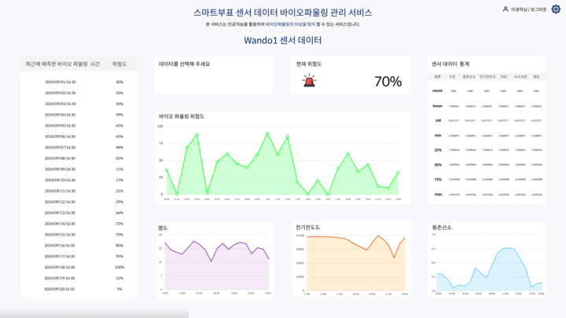

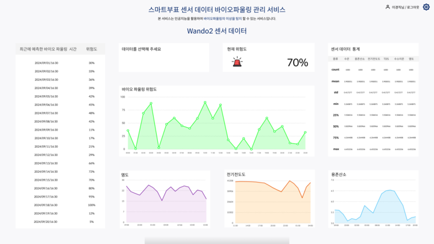

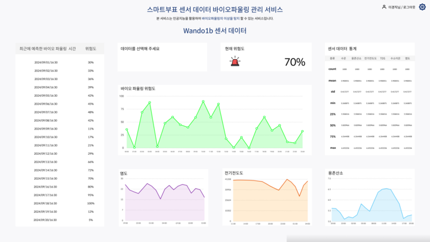

- API 요청을 통한 그래프 표시 기능
    
    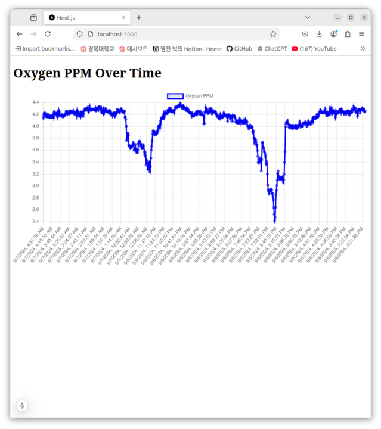
    
- 그래프 카드를 드래그로 위치 변경 기능
(이후에 완성과정에서 기능 유지가 힘들기도 하고 요구사항에 적힌 기능도 아니어서 삭제함)
    
    [Screencast from 2024-11-15 23-15-16.mp4](Screencast_from_2024-11-15_23-15-16.mp4)
    

---

2024년 11월 18일 

- 로그인 페이지 (CSV 파일을 통한 사용자 관리, 이후 DB 파일 관리 방법으로 수정함)
    
    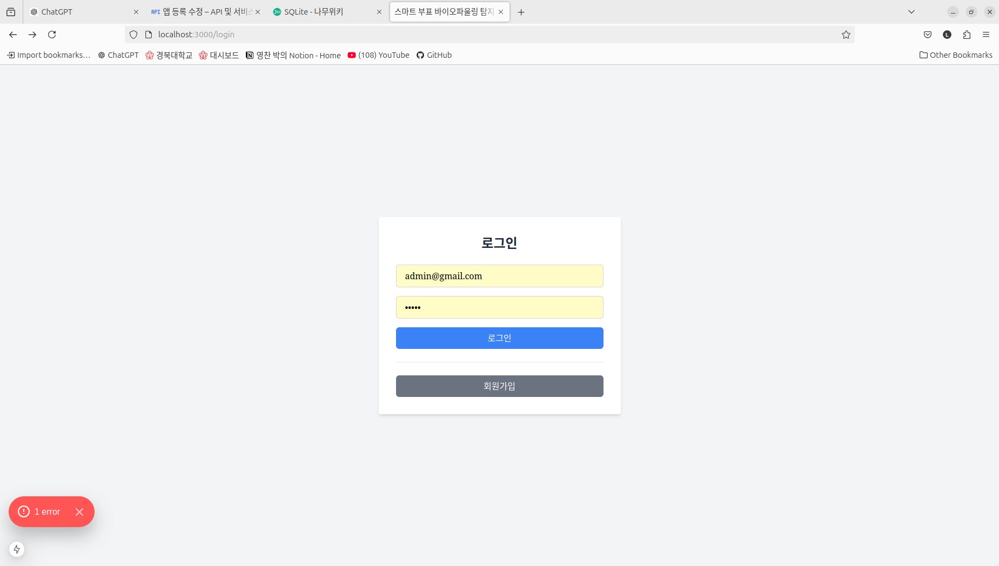
    

---

2024년 11월 20일 

- 자체 회의를 통한 디자인 1차 수정
    
    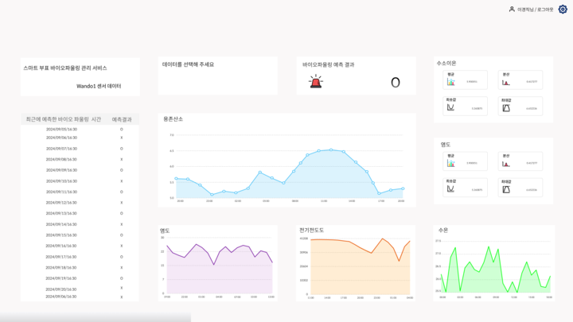
    

2024년 11월 21일 

- 2차 수정

---

2024년 11월 25일 

- API 요청을 통한 그래프표시기능을 디자인 설계대로 위치
    
    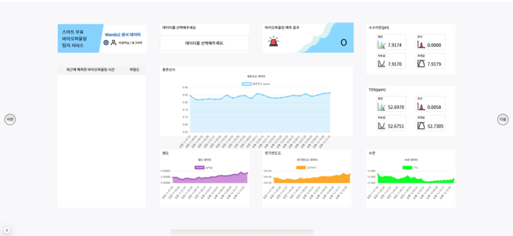
    

---

2024년 11월 28일 

- gird를 통한 반응형 웹페이지 코드로 수정 및 각 카드 간 간격 수정 및 전체적인 디테일 수정
    
    
    

- 관리자 페이지 구현
(사용자삭제 기능은 완료되지 않음)
    
    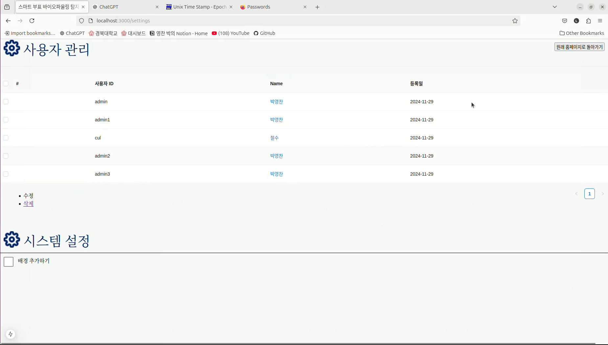
    

---

2024년 11월 29일 

- 기간 설정 기능 구현
    
    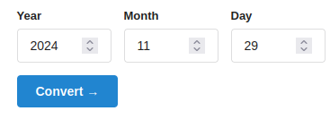
    
    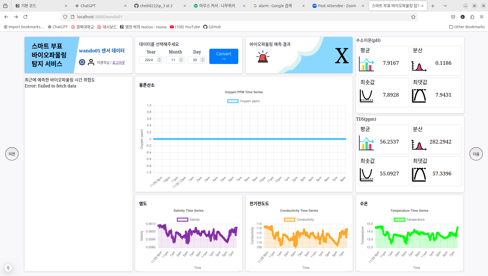
    

---

2024년 12월 1일 

- 로그인, 회원가입시 사용자 데이터 관리 방법 수정
기존 CSV관리에서 SQLite로 관리(db로 관리)

2024년 12월 2일 

- 관리자 삭제 기능 구현
- 화면(디바이스) 이동 버튼 디자인 변경 및 이상치 그래프 강조 표시기능 추가
    
    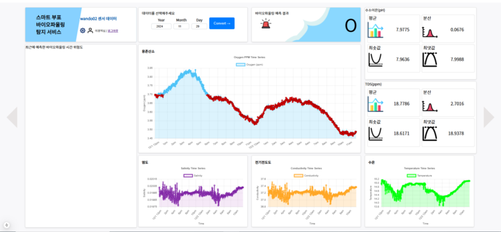
    

---

2024년 12월 3일 

- 완성본 시연 영상 (디테일한 부분은 수정필요)
    
    [https://youtu.be/1GptuqYTa00?si=tV4bQxREmq6oXe8k](https://youtu.be/1GptuqYTa00?si=tV4bQxREmq6oXe8k)