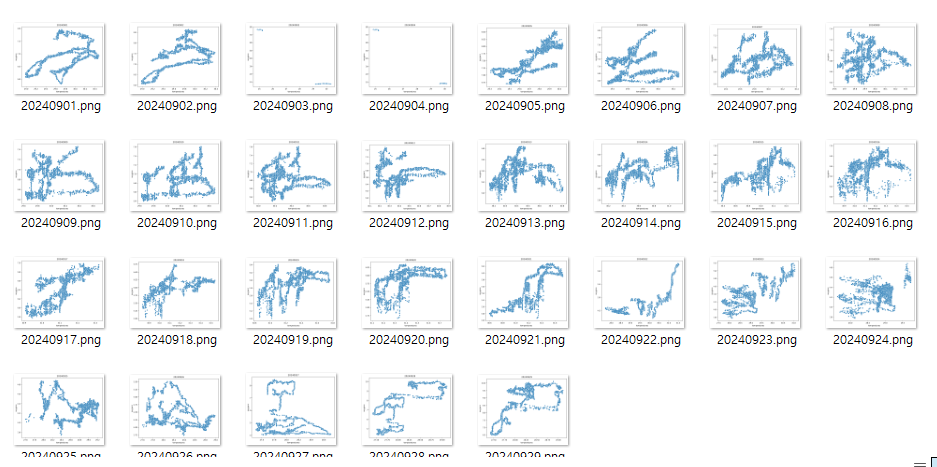

# 해양 데이터 간의 상관 관계 (박영찬)

API로 가져온 데이터의 상관 관계를 파악하고자 함

---

### 이 결과를 어디에 활용할 것인가?

- 사실 아직 모름
- 우선 데이터간의 상관 관계를 파악한다면 추후 이상값을 파악하는데 도움이 될지 모른다는 생각으로 진행중

---

### 데이터 종류

- 수온
- 용존 산소
- 수소이온농도
- 전기전도도
- 염도
- TDS - 총 용존 고형물, 물속에 녹아있는 고형물질의 총량을 의미

---

### 추출한 방법

- [주혁님이 작성하신 글](https://www.notion.so/AI-11108556ef3880b98eccdca764cdee11?pvs=21)에 포함된 파일을 변형시켜 작성함

- 간단한 설명을 하자면
    - 상관 관계를 알고싶은 데이터를 2개 입력함 - 수온, 염도
    - 3000개의 데이터를 가져옴 (대략 2일치 조금 넘는 데이터 )
    - 두 데이터의 값만을 비교하여 산점도를 그림
    - 그려진 그래프 파일의 이름은 “20240901”과 같이 탐색한 기간의 end_time으로 되도록 자동화 함. 추가로 지정한 경로에 자동으로 파일이 저장되도록 자동화함.

---

### 추출한 데이터의 기간

- 우선 9월 1일 - 9월 29일까지의 값을 추출하여 상관관계를 파악해봄
    - 9월 30일은 평균데이터 값에서 한참 벗어난 이상치가 기록되어있어 코드를 실행시키면 시간이 오래걸리길래 제외함

---

### 그래프

- **수온 - 용존산소**
    
    
    
- **수온 - 수소이온농도**
    
    
    
- **수온 - 전기전도도**
    
    
    
- **수온 - 염도**
    
    
    
- **수온 - TDS**
    
    
    
- **용존산소 - 수소이온농도**
    
    
    
- **용존산소 - 전기 전도도**
    
    
    
- **용존산소 - 염도**
    
    
    
- **용존산소 - TDS**
    
    
    
- **수소이온농도 - 전기전도도**
    
    
    
- **수소이온농도 - 염도**
    
    
    
- **수소이온농도 - TDS**
    
    
    
- 전기 전도도 - 염도
    
    
    
- **전기 전도도 - TDS**
    
    
    
- **염도 - TDS**
    
    
    

---

### 결과

- 데이터 간의 유의미한 상관관계는
    - 용존산소 - 수소이온농도
    - 전기전도도 - 염도
    - 전기전도도 - TDS
    - 염도 - TDS
    
    들이 양의 상관관계 즉, 하나가 증가하면 다른 하나도 같이 증가하는 경향이 있다
    
- 특히 전기전도도 - 염도 - TDS는 서로 강하게 연관되어있어 산점도가 선형에 가까운 것을 볼수 있다.
- 따라서 전기전도도 - 염도 - TDS 를 분석 했을때 만약 다른 두개와 차이가나는 데이터가 측정된다면 그 데이터가 이상데이터라고 판단할 수 있을 것이다.

---

### 왜 외부 자료를 찾는 것 대신 내부데이터를 분석하였는가?

- 외부 자료를 통해 A 와 B의 이론상 상관관계를 알게되었다고해도 실제 센서가 존재하는 환경에는 다양한 변수로 상관관계가 틀어질수 있다고 판단함. 따라서 실제 센서가 측정한 데이터를 가지고 상관관계를 파악하는 것이 더 유의미할것같아 내부 데이터를 분석함.