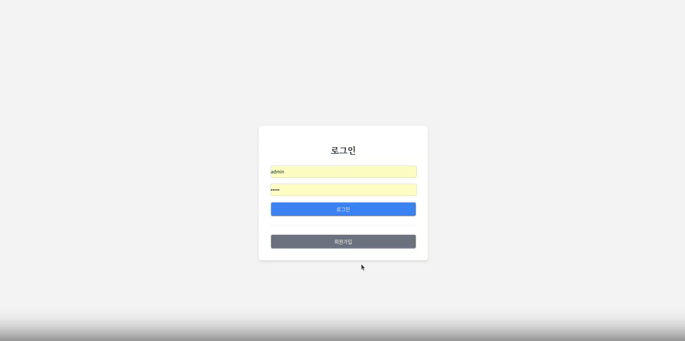
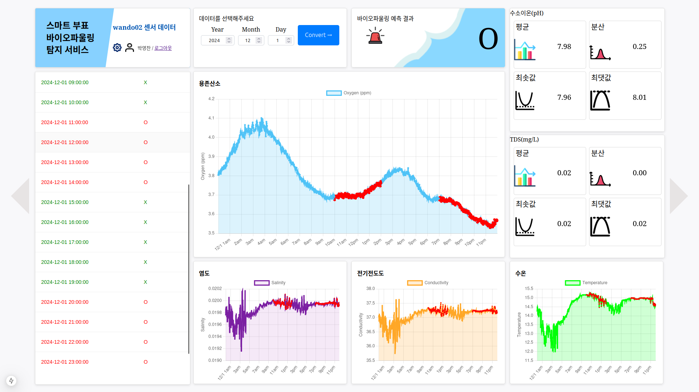

# 프론트 완성본 설명서

---

# 로그인 페이지

- Next-Auth 라이브러리를 통해 인증절차 구현(jwt 토근 이용)
- jwt 토큰 및 middleware를 통한 사용자 인증없이 url로 접속 방지

```c
export async function middleware(req) {
  const token = await getToken({ req, secret: process.env.NEXTAUTH_SECRET });
  if (!token) {
    const url = new URL('/login', req.url);
    // 이미 error 쿼리 파라미터가 없을 때만 추가
    if (!url.searchParams.has('error')) {
      url.searchParams.set('error', 'authentication_required');
    }
    return NextResponse.redirect(url);
  }
  // 인증된 경우 요청을 계속 처리
  return NextResponse.next();
}
export const config = {
  matcher: ['/protected/:path*', '/api/api_protect/:path*'], // 보호할 경로 설정
};
```



- 아이디, 비번을 통한 로그인

---

# 회원가입 페이지

- SQLite(db파일)로 사용자 데이터 관리

```
CREATE TABLE "User" (
    "key_id" TEXT NOT NULL PRIMARY KEY,
    "id" TEXT NOT NULL,
    "name" TEXT,
    "password" TEXT,
    "regi_date" DATETIME
);
```

- password는 next-auth에서 제공하는 해시암호화 함수로 저장

```
  // 비밀번호 해싱
  const hashedPassword = await bcrypt.hash(password, 10);
```


---

# 메인 페이지



- 총 10개의 카드로 이루어짐
    - 좌상단 카드
        
        
        
        - 웹 페이지명
        - 센서 디바이스 명
        - 관리자 페이지 이동 버튼
            
            
            
        - 현재 사용자 이름 표시
        - 로그아웃 버튼
    - 좌하단 카드
        
        
        
        - 백엔드 서버에서 api 요청을 하여 과거 AI 예측 결과를 표시
        - 빨간색 - “바이오파울링 발생함”으로 예측
        - 초록색 - “바이오파울링 없음”으로 예측
    - 기간 설정 카드
        
        
        
        - 기간을 설정 후 Convert 버튼을 누르면 
        설정한 기간을 API 요청시 파라미터로 사용하여 요청
    - 최근 바이오파울링 예측 결과 표시
        
        
        
        - “O” : 현재 바이오파울링이 발생함
        - “X” :  현재 바이오 파울링이 없음
        - 가장 최근의 예측결과를 불러오는 것이라 
        기간 설정에 따른 변화 없음
    - 메인 그래프(용존산소 그래프)
        
        
        
        - 용존산소 센서 디바이스 api 요청으로 반환받은 데이터를 그래프로 표시한 카드
        - 한 화면에 24시간의 데이터를 표시
        - 빨간색 부분은 AI가 바이오 파울링이라고 탐지한 데이터들을 강조 표시한 것
    - 하단 서브 그래프(염도, 전기전도도, 수온)
        
        
        
        - 염도, 전기전도도, 수온 센서 디바이스 api 요청에서 반환 받은 데이터를 그래프로 표시한 카드
        - 이외는 메인그래프와 같은 기능
    - 수소이온, TDS 센서 데이터   분석 결과
        
        
        
        - 평균, 분산, 최솟값, 최댓값을 표시

---

# 관리자 페이지


- 사용자 관리
    - 사용자 db에 등록된 사용자를 모두 표시
    - 사용자가 삭제 가능
- 시스템 설정
    - 웹페이지에서 배경을 추가할 수 있음